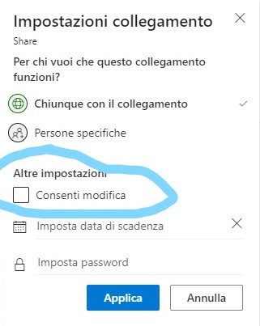
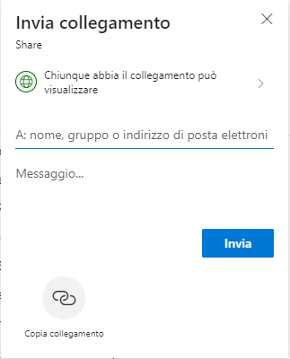
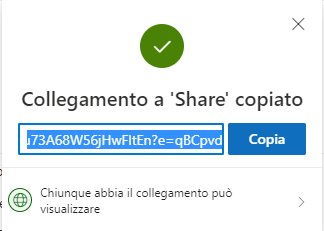

# DirectDownloadLink-Onedrive

> author: Andrea Grandieri g.andreus02@gmail.com [https://github.com/AndreaGrandieri](https://github.com/AndreaGrandieri)

The following project makes you able to create __Direct Download Link__ for __Onedrive__
given a _classic_ sharable link.

Here's the difference:

- Onedrive Classic Sharing Link: it opens a web interface to visualize the file and download
  it using an embedded (gui) botton
- Direct Download Link Onedrive: it lets you immediately download the requested file, throught
  the Microsoft API. Perfect to share a _mirror like_ link, mostly used for automatic programs
  that aren't able to interact with a gui!

You can download the Visual Studio solution or run the following snippet in any C# environment:

> ONLY FOR PERSONAL ONEDRIVE USE. NO BUSINESS (SHAREPOINT) COMPATIBILITY.
> ONLY FOR SINGLE FILE. NO FOLDER COMPATIBILITY!!

```csharp
/*
 * @author: Andrea Grandieri g.andreus02@gmail.com https://github.com/AndreaGrandieri
 */

using System;

/*
 * ONLY FOR PERSONAL ONEDRIVE USE. NO BUSINESS (SHAREPOINT) COMPATIBILITY.
 * ONLY FOR SINGLE FILE. NO FOLDER COMPATIBILITY!!
 */

/*
 * Il seguente programma permette, partendo da un link di sharing OneDrive (NON DI UNA
 * CARTELLA!) di ottenere un link Direct-Download.
 * Differenza:
 * - Link di sharing OneDrive: apre una interfaccia web per visualizzare il file, scaricabile
 * attraverso l'uso di un bottone dell'interfaccia
 * - Link Direct-Download: scarica direttamente il file, utilizzando le API di Microsoft.
 * Perfetto per fornire link di download di tipo "mirror", utilizzati soprattutto da programmi
 * automatici che non sarebbero in grado di interagire con una interfaccia grafica!
 */

/*
 * - Onedrive Classic Sharing Link: it opens a web interface to visualize the file and download
 * it using an embedded (gui) botton
 * - Direct Download Link Onedrive: it lets you immediately download the requested file, throught
 * the Microsoft API. Perfect to share a _mirror like_ link, mostly used for automatic programs
 * that aren't able to interact with a gui!
 */

namespace DirectDownloadLink_Onedrive
{
    class Program
    {
        static void Main(string[] args)
        {
            // Place here your CLASSIC sharing link (e.g.: https://1drv.ms/u/s!AmstWNn8EkEu73A68W56jHwFltEn?e=qBCpvd)
            string sharingUrl = "";
            string base64Value = System.Convert.ToBase64String(System.Text.Encoding.UTF8.GetBytes(sharingUrl));
            string encodedUrl = "u!" + base64Value.TrimEnd('=').Replace('/', '_').Replace('+', '-');
            string resultUrl = string.Format("https://api.onedrive.com/v1.0/shares/{0}/root/content", encodedUrl);

            // Here you're printing the resulting link. THIS IS YOUR READY-TO-USE (PERMANENT) DIRECT DOWNLOAD LINK.
            // Just copy it and you are all set!
            Console.WriteLine(resultUrl);
            Console.ReadLine();
        }
    }
}

```

---

## Obtaining the "Classic Sharing Link"

1. Choose your file and click on `Share`. This panel will show:

  

2. Now you have to change the privacy for the file: __it has to be set on READ-ONLY-SHARING__ (unckeck `Allow modify`):

  

3. Now your panel should look like this:

  

4. Finally get your _classic_ read only sharing link:

  
